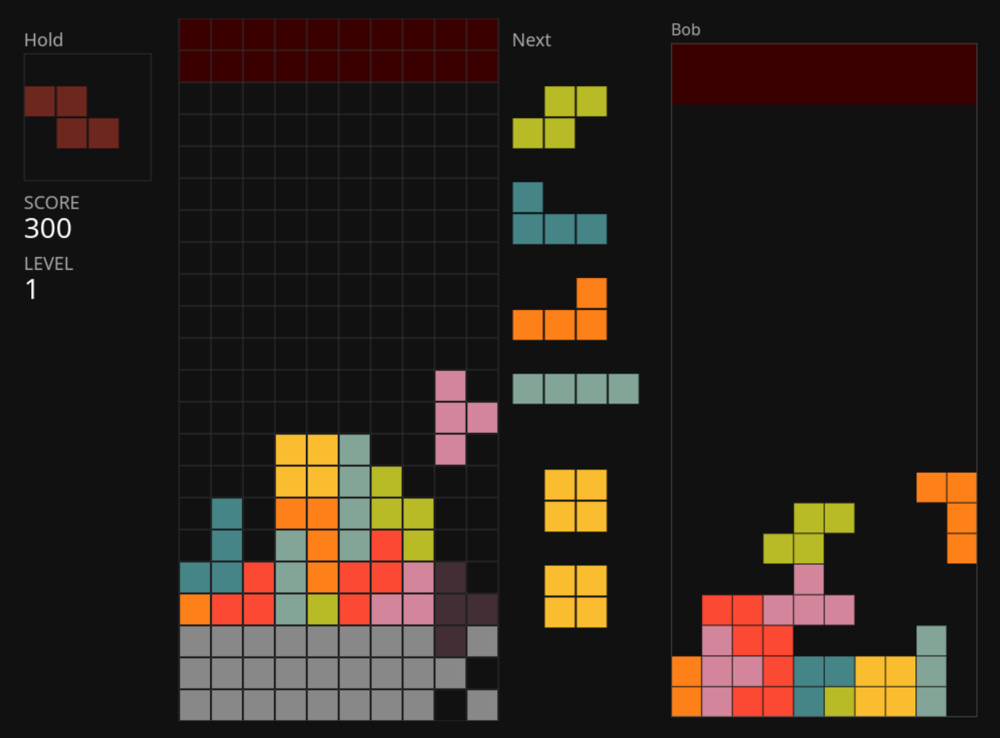

# Tetris, proved correct in Rocq

Tetris specified and proved correct in Rocq, with a JavaScript implementation that is itself proved (informally, and tested) to refine the Rocq model.




## Why

The usual approach to software treats the code as the source of truth. Here it is the other way around: the *model* is the source, and the code is derived from it, the way a binary is derived from source by a compiler. The model is written in Rocq, its invariants are machine-checked there, and the JavaScript code is generated from the model together with an implementation document (`implementation.md`, fixing every decision the model leaves open) and a refinement proof (`proofs.md`, arguing that the code is a faithful image of the model). The refinement proof is the one part of this chain that is not machine-checked: it is generated and must be checked by a human, which is why differential tests against an oracle derived from the model exist as a backstop.

The full reasoning behind this approach, including what is machine-checked and what is not, can be found at [github.com/jskri/model-as-source-development](https://github.com/jskri/model-as-source-development).

## Models

The model is a tower of refinements. Each model adds a feature on top of the previous one and is proved to refine it. Requirements are tracked in `definitions_requirements.md`, a hierarchical tree where each requirement has an id (`req-*`); models reference these ids for the requirements they address.

**T1**, core mechanics: piece movement, rotation, falling, fixing, line clearing, gameover. The main grid and pieces are unified under the notion of grid. A small grid algebra (union, intersection, translation, inclusion) allows one to express main operations. This model addresses `req-flow`, `req-piece-ctrl`, `req-piece-loc`, `req-piece-free`, `req-piece-init`, `req-piece-move-dir`, `req-piece-move-def`, `req-piece-rot`, `req-piece-fall`, `req-piece-fix`, `req-piece-fix-gameover`, `req-piece-fix-new`, `req-grid-clear`.

**T2**, refines T1 with score, level and combo. Addresses `req-score`, `req-score-init`, `req-score-formula`, `req-level`, `req-level-init`, `req-level-formula`.

**T3**, refines T2 with the hold mechanics (swapping the current piece with a held piece). Addresses `req-hold`, `req-hold-swap`, `req-hold-empty`, `req-hold-limit`.

**T4**, refines T3 with the next pieces preview mechanics (drawing next pieces from a bag randomizer and presenting them). Addresses `req-preview-len`, `req-preview-init`, `req-preview-pop`.

**T5**, refines T4 with the piece drop mechanics (dropping the current piece instantly). Addresses `req-piece-drop`, `req-piece-shadow`.

**T6**, refines T5 with the wall kick mechanics (offsetting a piece from an obstacle when it prevents rotation). Addresses `req-piece-kick`.

**T7**, refines T6 with the multi-player mode (sending garbage to opponents when clearing lines). Addresses `req-multi`, `req-multi-succ`, `req-multi-target-nonself`, `req-multi-garbage-gen`, `req-multi-garbage-cancel`, `req-multi-garbage-send`, `req-multi-garbage-materialize`, `req-multi-gameover`, `req-multi-winner`.

Each model Tx is in a file `Tx.v`. Proofs of state invariants, step invariants and refinements (of Tx-1) are in a file `TxProofs.v`.

Proof status: All proved (but T7's step invariants and refinement are not yet formulated).


## Checking the proofs

Tested with Rocq 9.1.0, dune 3.19.1, coq-hammer-tactics 1.3.2+9.1. The `hammer` tactic is not actually invoked by any proof in this repo, so no external ATP is required.

```sh
dune build
```

This type-checks every `.v` file; if it succeeds, every theorem (in particular the invariant and refinement proofs) is machine-checked.

Alternatively, if you want an empty output on success:

```sh
dune build --action-stdout-on-success=swallow --action-stderr-on-success=must-be-empty
```

The proofs can also be stepped through interactively in an editor. VSCode (tested with 1.124.0) picks up the project layout via `_CoqProject`.


## JavaScript implementations

Each model Tx has a JavaScript implementation in the directory `js/tx/`.

- `js/tx/implementation.md` details the implementation choices.

- `js/tx/proofs.md` informally proves that the code refines the Tx model.

- `js/tx/model.js` implements Tx: one function for the Tx module and Tx's `State` encapsulated in a `Machine` class.

- `js/tx/view.js` renders a `Machine` object.

- `js/tx/controller.js` instantiates a `Machine` object, dispatches events to the right methods, controls time and randomness, and performs rendering.

- `js/tx/instance.js` defines concrete values for Tx's parameters.

- `js/tx/tests/` contains unit tests, property-based tests, fuzz tests, and an oracle.

An additional `js/final/` implementation adds to `t7/`: sounds, clear-line/game-over animations, and a local hall of fame.


## Running the tests

```bash
cd js/ && npm install && npm test
```

## Running the game

1. Start a local HTTP server:

```bash
cd js/ && \
  npx serve -l 8000  # or python3 -m http.server -b 127.0.0.1 8000
```

2. Open `http://127.0.0.1:8000/final/` in a browser (or `http://127.0.0.1:8000/tx/` for a previous version, with `x` in 1-7).

### Input

| Action                         | Keyboard    | Gamepad     |
|--------------------------------|-------------|-------------|
| move piece left                | left arrow  | left d-pad  |
| move piece right               | right arrow | right d-pad |
| move piece down                | down arrow  | down d-pad  |
| drop piece                     | up arrow    | up d-pad    |
| rotate piece clockwise         | x           | button 1    |
| rotate piece counter-clockwise | z           | button 0    |
| hold piece                     | space       | button 3    |

No separate configuration file exists at the moment. To change the input, edit `KEYMAP`/`GAMEPAD_MAP` in the corresponding `controller.js`.

### Multiplayer mode

`t7/` and `final/` implement the multiplayer mode. One player must host the game, others must join. A joiner must send the host a generated "offer" through an external channel. The host adds a connection for each offer and must send the "answer" back to corresponding joiner. Once the offers/answers have been exchanged, the game can start.


## File tree

```
.
├── dune-project
├── dune
├── _CoqProject
├── README.md
├── LICENSE
├── definitions_requirements.md
├── T1.v
├── T1Proofs.v
├── T2.v
├── T2Proofs.v
├── T3.v
├── T3Proofs.v
├── T4.v
├── T4Proofs.v
├── T5.v
├── T5Proofs.v
├── T6.v
├── T6Proofs.v
├── T7.v
├── T7Proofs.v
├── Notations.v
├── QuantifiersProofs.v
├── Quantifiers.v
├── img
│   └── tetris.png
└── js
    ├── package.json
    ├── package-lock.json
    ├── lib
    │   └── utils.js
    ├── vendor
    │   └── fflate.js
    ├── final
    │   ├── controller.js
    │   ├── highscores.js
    │   ├── index.html
    │   ├── instance.js
    │   ├── proofs.md
    │   ├── sound.js
    │   ├── sp_controller.js
    │   └── view.js
    ├── t1
    │   ├── implementation.md
    │   ├── proofs.md
    │   ├── model.js
    │   ├── view.js
    │   ├── controller.js
    │   ├── instance.js
    │   ├── index.html
    │   └── tests
    │       ├── model.fuzz.test.js
    │       ├── model.properties.test.js
    │       ├── model.unit.test.js
    │       ├── oracle.js
    │       └── testInstance.js
    ├── t2
    │   ├── implementation.md
    │   ├── proofs.md
    │   ├── model.js
    │   ├── view.js
    │   ├── controller.js
    │   ├── instance.js
    │   ├── index.html
    │   └── tests
    │       ├── model.fuzz.test.js
    │       ├── model.properties.test.js
    │       ├── model.unit.test.js
    │       ├── oracle.js
    │       └── testInstance.js
    ├── t3
    │   ├── implementation.md
    │   ├── proofs.md
    │   ├── model.js
    │   ├── view.js
    │   ├── controller.js
    │   ├── instance.js
    │   ├── index.html
    │   └── tests
    │       ├── model.fuzz.test.js
    │       ├── model.properties.test.js
    │       ├── model.unit.test.js
    │       ├── oracle.js
    │       └── testInstance.js
    ├── t4
    │   ├── implementation.md
    │   ├── proofs.md
    │   ├── model.js
    │   ├── view.js
    │   ├── controller.js
    │   ├── instance.js
    │   ├── index.html
    │   └── tests
    │       ├── model.fuzz.test.js
    │       ├── model.properties.test.js
    │       ├── model.unit.test.js
    │       ├── oracle.js
    │       └── testInstance.js
    ├── t5
    │   ├── implementation.md
    │   ├── proofs.md
    │   ├── model.js
    │   ├── view.js
    │   ├── controller.js
    │   ├── instance.js
    │   ├── index.html
    │   └── tests
    │       ├── model.fuzz.test.js
    │       ├── model.properties.test.js
    │       ├── model.unit.test.js
    │       ├── oracle.js
    │       └── testInstance.js
    ├── t6
    │   ├── implementation.md
    │   ├── proofs.md
    │   ├── model.js
    │   ├── view.js
    │   ├── controller.js
    │   ├── instance.js
    │   ├── index.html
    │   └── tests
    │       ├── model.fuzz.test.js
    │       ├── model.properties.test.js
    │       ├── model.unit.test.js
    │       ├── oracle.js
    │       └── testInstance.js
    └── t7
        ├── implementation.md
        ├── proofs.md
        ├── model.js
        ├── view.js
        ├── controller.js
        ├── instance.js
        ├── index.html
        └── tests
            ├── model.fuzz.test.js
            ├── model.properties.test.js
            ├── model.unit.test.js
            ├── oracle.js
            └── testInstance.js
```


## License

MIT.

